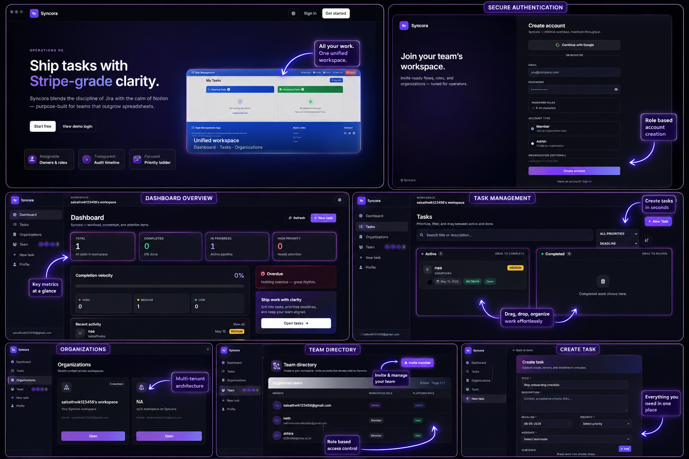
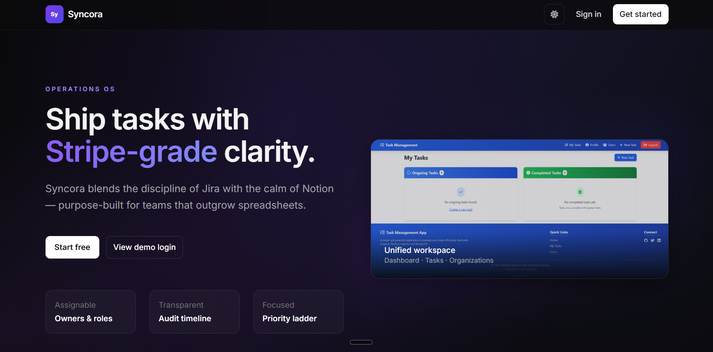
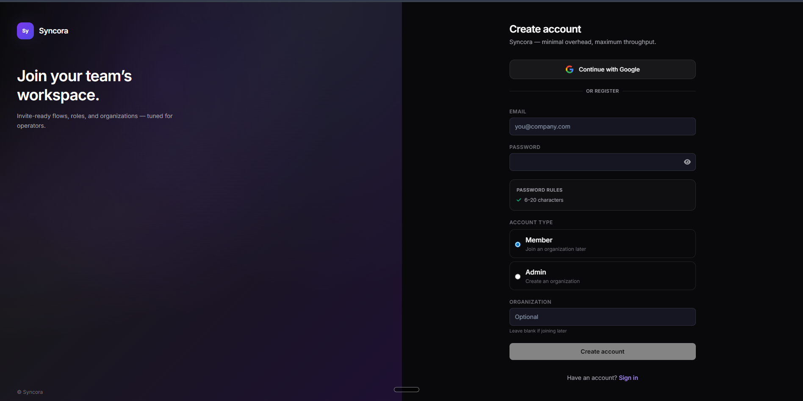
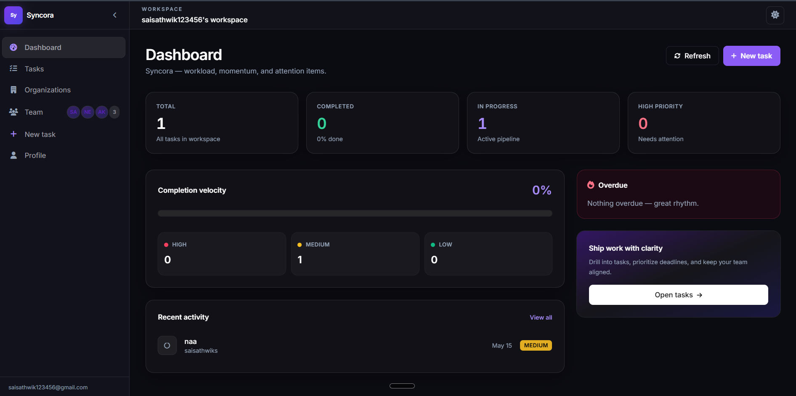
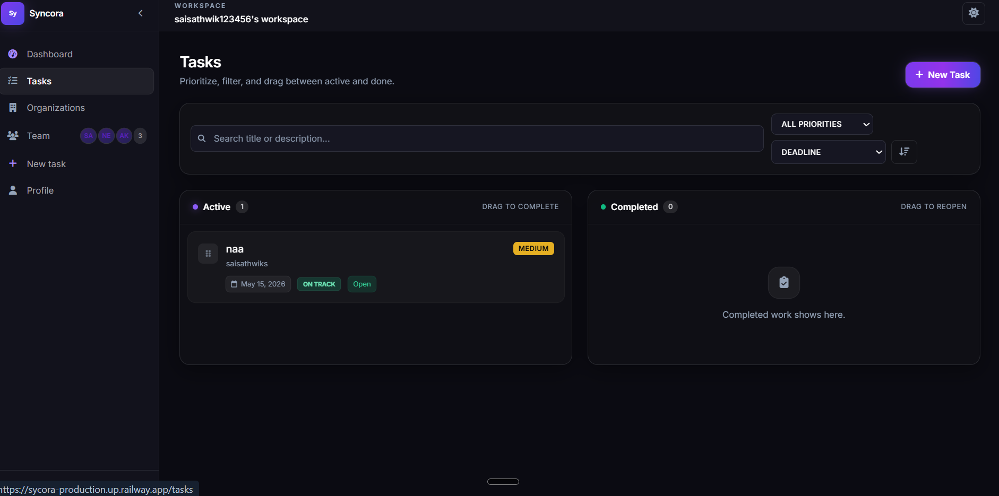
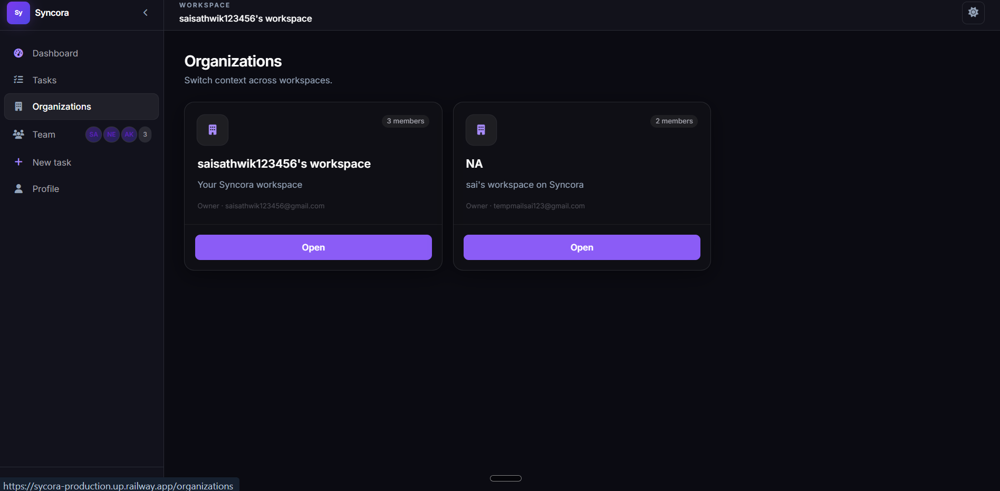
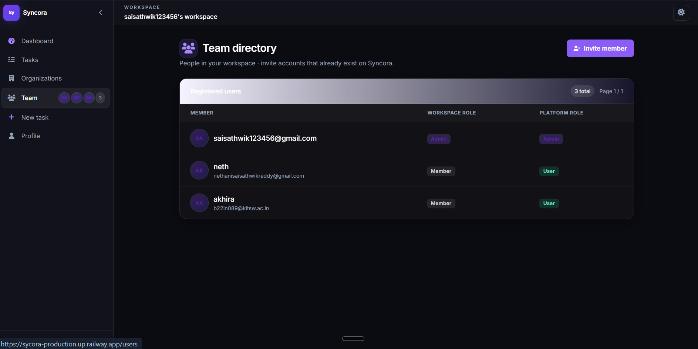
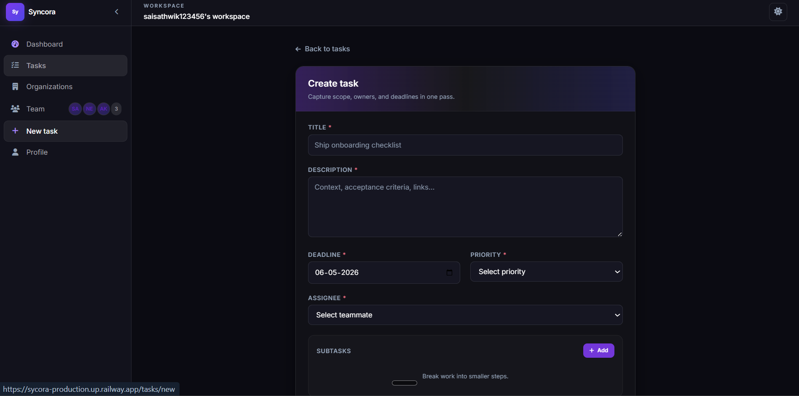

# Syncora ⚡

<p align="center">
  
</p>

<h1 align="center">🚀 Syncora — Modern Team Execution Platform</h1>

<p align="center">
Built for startups, teams, and organizations that need speed, structure, and collaboration.
</p>

---

## ✨ Why Syncora?

✅ Multi-tenant organization architecture  
✅ Role-based access control  
✅ Team collaboration workflows  
✅ Task assignment & tracking  
✅ Analytics dashboard  
✅ Google OAuth + JWT authentication  
✅ Modern enterprise UI  

Think of it as:

**Jira + Notion + Team Collaboration → Combined into one platform**

---

## 📸 Product Screens

### Landing Page


---

### Authentication Flow


✔ Google OAuth  
✔ JWT Authentication  
✔ Secure Login  

---

### Dashboard Analytics


Track:
- Task completion
- Pending work
- Team productivity
- Activity logs

---

### Task Management


Features:
- Create tasks
- Assign tasks
- Set deadlines
- Search/filter
- Priority management

---

### Organization Management


- Multi-workspace support  
- Organization switching  
- Member management  

---

### Team Collaboration


- Invite teammates  
- Assign roles  
- Team permissions  

---

### Task Creation Flow


- Assign members  
- Set priorities  
- Add descriptions  
- Deadlines  

---

## 🏗 System Architecture

```text
Angular Frontend
      ↓
Node.js + Express API
      ↓
MongoDB Database
      ↓
Authentication Layer
      ↓
Role Management Engine
```

---

## 🛠 Tech Stack

### Frontend
- Angular 19
- Tailwind CSS
- TypeScript
- RxJS

### Backend
- Node.js
- Express.js

### Database
- MongoDB
- Mongoose

### Authentication
- JWT
- Google OAuth

### Deployment
- Railway
- Vercel

---

## 🌍 Live Demo

Frontend: https://sycora-production.up.railway.app  
Backend: Add backend deployment link here  

---

## ⚙️ Installation

### Clone Repository

```bash
git clone https://github.com/SaiSathwikReddyN/TaskManagementApp.git
cd TaskManagementApp
```

### Backend Setup

```bash
cd backend
npm install
npm run dev
```

### Frontend Setup

```bash
npm install
ng serve
```

---

## 🔐 Environment Variables

```env
PORT=
MONGO_URI=
JWT_SECRET=
GOOGLE_CLIENT_ID=
GOOGLE_CLIENT_SECRET=
```

---

## 🚀 Future Improvements

- Real-time notifications  
- WebSocket collaboration  
- AI task prioritization  
- Slack integration  
- Advanced analytics  
- Kanban board  

---

## 💼 Why Recruiters Should Notice This Project

Most freshers build:

❌ Todo apps  
❌ Weather apps  
❌ Netflix clones  

Syncora demonstrates:

✅ Product thinking  
✅ Multi-tenancy  
✅ Authentication systems  
✅ Team workflows  
✅ Scalable backend architecture  
✅ Real-world SaaS design  

This project looks like something a startup could actually monetize.

---

## 👨‍💻 Author

**Sai Sathwik**

GitHub: https://github.com/SaiSathwikReddyN  
LinkedIn: Add your LinkedIn link  
Portfolio: Add your portfolio link  

---

<p align="center">
⭐ If you like this project, consider starring the repo.
</p>
